# 🚀 Flutter Portfolio App

A modern, responsive **personal portfolio application built with Flutter**, showcasing my experience, projects, technical skills, and contact details.  
Designed with clean UI, smooth navigation, and mobile-first best practices.

---

## ✨ Features

- 📱 Mobile-first responsive design
- 🌗 Light & Dark theme support
- 🧭 Bottom navigation for smooth section scrolling
- 📄 Resume viewer & download
- 💼 Experience & Projects sections
- 🛠️ Technical skills with brand colors
- 📞 Contact actions (Call, Email, LinkedIn, GitHub)
- ⚡ Optimized Flutter performance

---

## 🧰 Tech Stack

- **Framework:** Flutter
- **Language:** Dart
- **UI:** Material Design
- **State Handling:** Stateful widgets
- **Navigation:** ScrollController + BottomNavigationBar
- **External Actions:** url_launcher
- **Icons:** Material Icons & FontAwesome

---

## 📂 Project Structure

```bash
lib/
├── sections/
│ ├── hero_section.dart
│ ├── about_section.dart
│ ├── experience_section.dart
│ ├── projects_section.dart
│ ├── skills_section.dart
│ └── contact_section.dart
├── resume_viewer.dart
├── home_screen.dart
└── main.dart
```


---

## 📸 Screenshots

### 🏠 Home / Hero Section
<p align="center"> 
  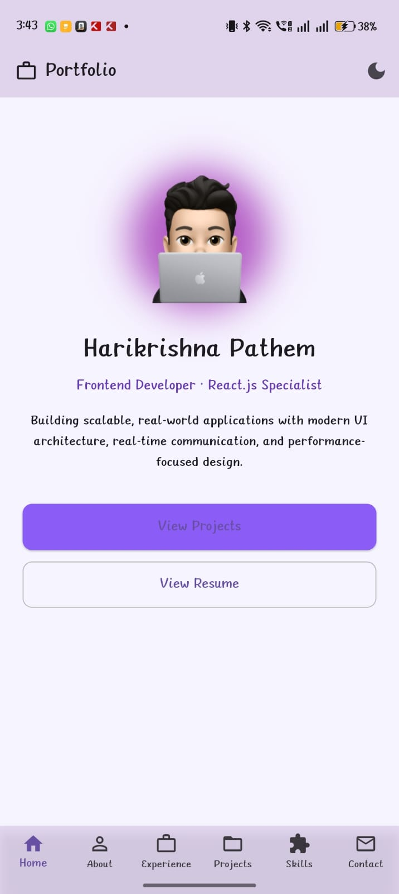
  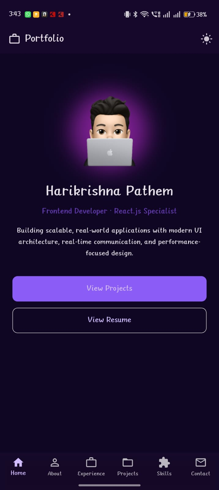 
</p> 

### 👤 About Section
<p align="center">
  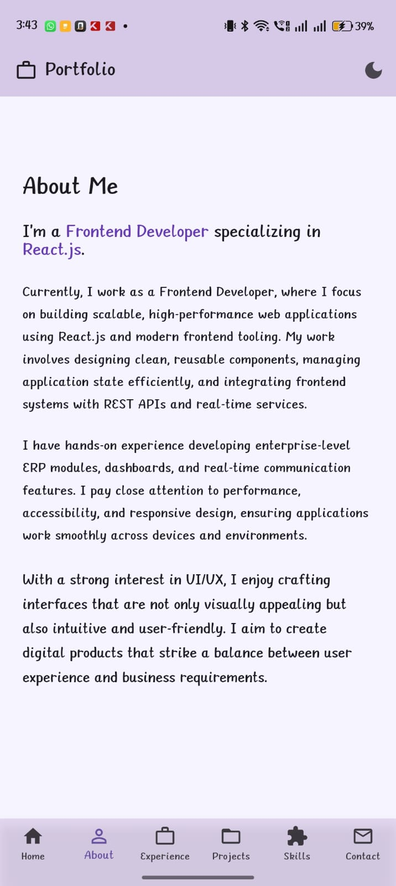
  
</p>


### 💼 Experience
<p align="center">
  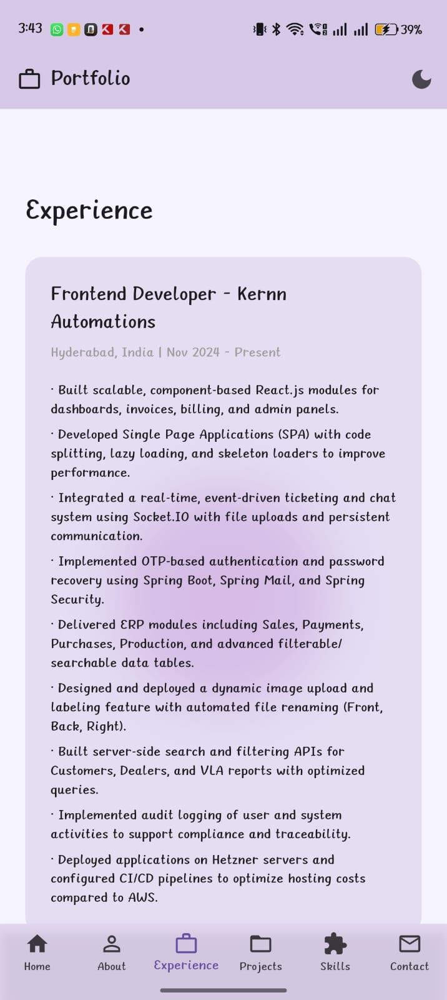
  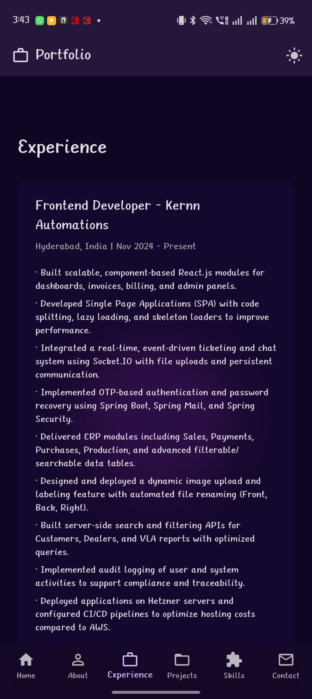
</p>


### 📂 Projects
<p align="center">
  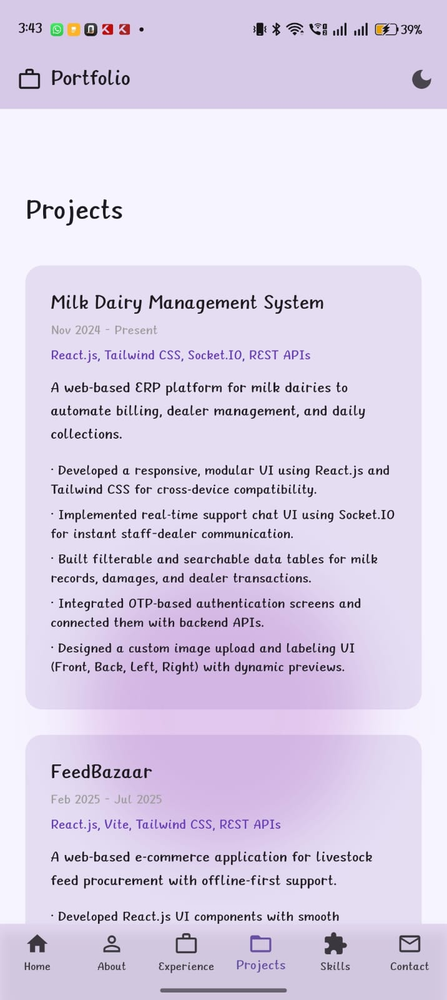
  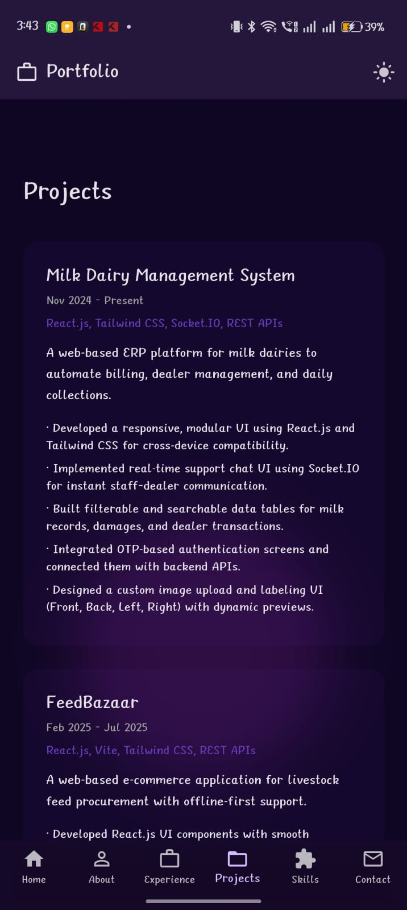
</p>


### 🛠️ Skills
<p align="center">
  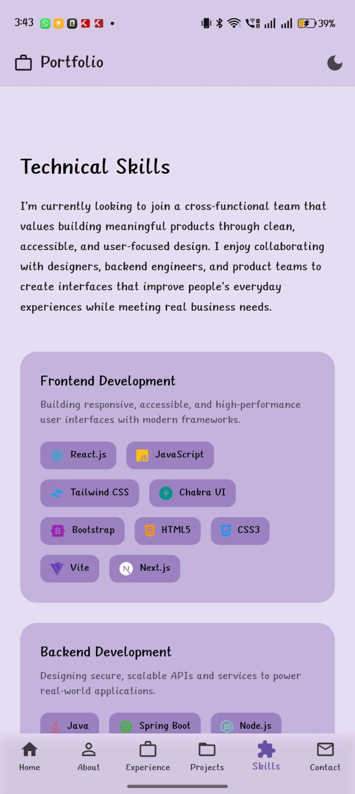
  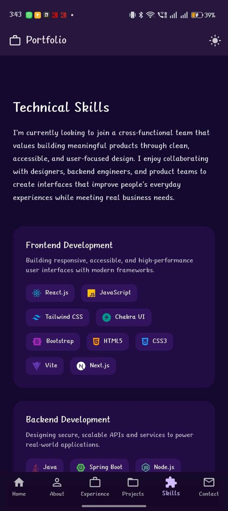
</p>


### 📞 Contact
<p align="center">
  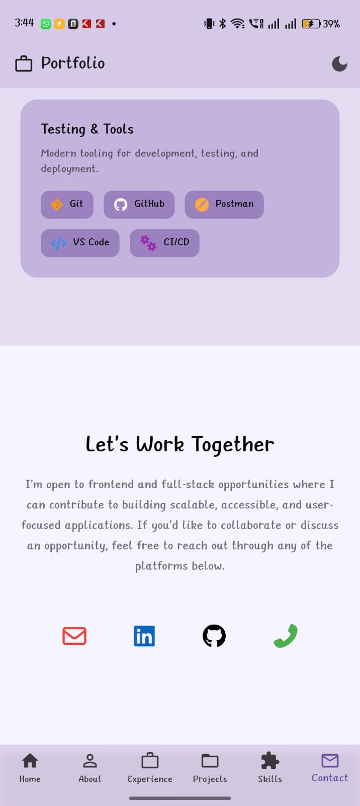
  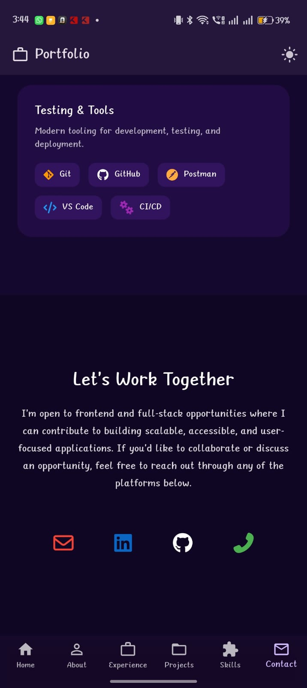
</p>

---

## ▶️ How to Run Locally

```bash
flutter pub get
flutter run
```
---

## 📥 Download APK (Android)

You can download and install the latest Android build of the portfolio app using the link below:

👉 **[Download APK – Flutter Portfolio App](https://github.com/Harikrishna-Pathem/flutter-portfolio/blob/main/release-latest/app-release.apk)**

### Installation Steps
1. Download the APK on your Android device
2. Open the file and allow **Install from unknown sources**
3. Install and launch the app

> ⚠️ This APK is safe and built directly from this repository using Flutter release mode.


